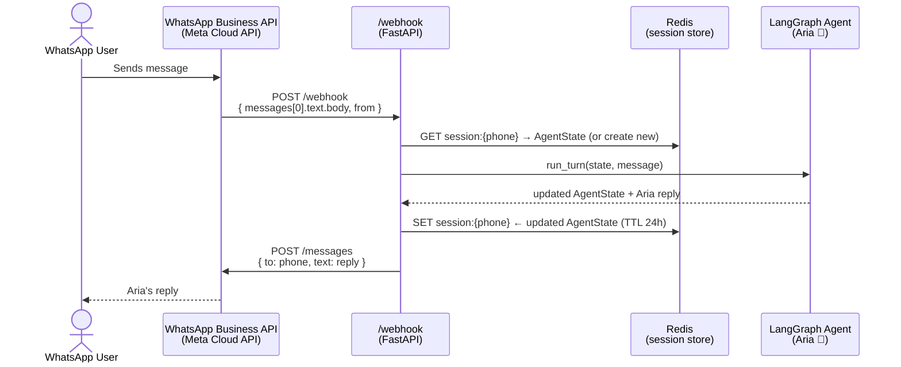

<div align="center">

# 🎬 AutoStream Agent

**An AI-powered sales assistant for AutoStream — built on LangGraph, Claude, and FAISS RAG.**

[](https://www.python.org/)
[](https://github.com/langchain-ai/langgraph)
[](https://www.anthropic.com/)
[](https://github.com/Textualize/rich)
[](LICENSE)

</div>

---

## ✨ What is AutoStream Agent?

AutoStream Agent is a multi-turn conversational AI that acts as **Aria 🤖** — a warm, knowledgeable sales assistant for AutoStream, a cloud-based video streaming SaaS. It:

- Classifies user intent in real time (greeting / product inquiry / high-intent lead / off-topic)
- Retrieves relevant answers from a FAISS-backed knowledge base
- Guides high-intent visitors through a 3-field lead capture flow (name → email → platform)
- Validates and persists leads atomically with a guard assertion
- Runs with a gorgeous Rich terminal UI featuring live streaming output

---

## 🚀 Section 1 — Setup & Run

### Prerequisites

| Tool | Version |
|------|---------|
| Python | 3.11 + |
| pip | latest |
| Anthropic API key | [Get one here](https://console.anthropic.com/) |

### Quick start

```bash
# 1. Clone the repository
git clone https://github.com/ssmadhavan006/autostream-agent
cd autostream-agent

# 2. Create and activate virtual environment
python -m venv venv

# macOS / Linux
source venv/bin/activate

# Windows
venv\Scripts\activate

# 3. Install all dependencies (exact frozen versions)
pip install -r requirements.txt

# 4. Configure environment
cp .env.example .env
# Open .env and set:  ANTHROPIC_API_KEY=sk-ant-...

# 5. (One-time) Build the FAISS knowledge-base index
python -m rag.loader

# 6. Launch the Rich terminal UI
python -m ui.cli
```

> **Windows users:** Use `venv\Scripts\activate` (no `source`). All other commands are identical.

### Environment variables (`.env.example`)

```ini
ANTHROPIC_API_KEY=your_key_here
LLM_MODEL=claude-3-haiku-20240307
EMBEDDING_MODEL=all-MiniLM-L6-v2
```

### Running tests

```bash
pytest tests/ -v
```

---

## 🏗️ Section 2 — Architecture

### High-level flow

```
User input
    │
    ▼
┌────────────────────┐
│  classify_intent   │  ← structured Claude call → Pydantic-validated IntentResult
└────────┬───────────┘
         │ intent enum
         ├─── GREETING / OFF_TOPIC ───────────────────────► generate_response ──► reply
         │
         └─── PRODUCT_INQUIRY / HIGH_INTENT_LEAD ──────► retrieve_context
                                                               │
                                                          FAISS top-k chunks
                                                               │
                                                    ┌──────────▼──────────┐
                                                    │    collect_lead      │  (if high-intent)
                                                    │  name→email→platform │
                                                    └──────────┬───────────┘
                                                               │ all fields filled?
                                                     ┌─────────┴─────────┐
                                                    YES                  NO
                                                     │                   │
                                              capture_lead         generate_response
                                           (mock CRM write)          (prompt next field)
```

### Design decisions

**1. Why LangGraph?**
LangGraph gives us an explicit, inspectable state machine rather than an opaque chain. Every transition — from intent classification to RAG retrieval to lead capture — is a named node with deterministic routing logic. This makes the system production-debuggable: we can replay any turn by re-injecting the `AgentState` snapshot. Unlike vanilla LangChain, LangGraph compiles the graph upfront and validates all edges, catching wiring bugs at startup rather than mid-conversation.

**2. State management — zero global variables**
`AgentState` is a `TypedDict` that flows immutably through every node. Each node receives the full state and returns only the fields it mutates; LangGraph merges the partial update. This means any node can be unit-tested in complete isolation by constructing a mock `AgentState` dict — no patching or complex fixtures needed.

**3. RAG pipeline — FAISS + sentence-transformers**
Product knowledge lives in a FAISS vector index built with `sentence-transformers/all-MiniLM-L6-v2`. Retrieval runs **only** for `PRODUCT_INQUIRY` and `HIGH_INTENT_LEAD` intents, keeping latency and cost low for greetings and off-topic turns. A confidence threshold filters out low-signal chunks before they reach the LLM context window. The index is pre-built and committed (`faiss_index/`) so production startup is instant — no re-embedding at launch.

**4. Intent detection with Pydantic validation**
The classifier makes a structured Claude call requesting JSON with three fields: `intent`, `confidence`, and `reasoning`. The raw string is parsed by an `IntentResult` Pydantic model, which clamps confidence to `[0.0, 1.0]` and rejects unknown intent strings at parse time — the LLM can never inject an invalid enum value. A stateful sticky-intent rule also keeps `HIGH_INTENT_LEAD` active if a hot prospect goes slightly off-topic, preventing mid-flow resets.

**5. Tool guard — three-field assertion before lead capture fires**
`capture_lead_node` contains a hard `assert` that all three fields (name, email, platform) are non-empty before calling `mock_lead_capture`. If the graph ever routes to this node prematurely (a routing bug), the assertion fires loudly and surfaces the error rather than silently writing a corrupt lead record. Email format is independently validated by `validate_email()` (RFC-5321 regex) during collection — a bad address is rejected and the agent re-asks politely before the field is accepted into state.

---

## 📱 Section 3 — WhatsApp Webhook Integration

### Architecture diagram



### Step-by-step integration guide

#### 1. Create the webhook endpoint

```python
# webhook.py
import json
import os
import redis
import requests
from fastapi import FastAPI, Request

from agent.graph import run_turn
from agent.state import AgentState, initial_state

app   = FastAPI()
store = redis.Redis(host="localhost", port=6379, decode_responses=True)

WA_TOKEN     = os.environ["WHATSAPP_TOKEN"]      # Meta permanent token
WA_PHONE_ID  = os.environ["WHATSAPP_PHONE_ID"]   # Sender phone number ID
VERIFY_TOKEN = os.environ["WA_VERIFY_TOKEN"]      # Self-chosen challenge token


@app.get("/webhook")
async def verify(request: Request):
    """Meta webhook verification handshake."""
    params = request.query_params
    if params.get("hub.verify_token") == VERIFY_TOKEN:
        return int(params["hub.challenge"])
    return {"error": "invalid verify token"}, 403


@app.post("/webhook")
async def receive_message(request: Request):
    body = await request.json()

    # Navigate the Meta payload structure
    try:
        msg_obj = body["entry"][0]["changes"][0]["value"]["messages"][0]
        phone   = msg_obj["from"]               # e.g. "919876543210"
        text    = msg_obj["text"]["body"]
    except (KeyError, IndexError):
        return {"status": "ignored"}            # not a text message event

    # ── Load or create session state keyed by phone number ───────────────────
    raw   = store.get(f"session:{phone}")
    state: AgentState = json.loads(raw) if raw else initial_state(session_id=phone)

    # ── Run one turn through the LangGraph agent ──────────────────────────────
    state = run_turn(state, text)

    # ── Persist updated state (24-hour TTL) ───────────────────────────────────
    store.setex(f"session:{phone}", 86400, json.dumps(state))

    # ── Extract Aria's reply and send it back via WhatsApp ────────────────────
    aria_reply = next(
        (m["content"] for m in reversed(state["messages"]) if m["role"] == "assistant"),
        "I'm sorry, I couldn't process that. Please try again!",
    )
    _send_whatsapp(phone, aria_reply)

    return {"status": "ok"}


def _send_whatsapp(to: str, message: str) -> None:
    """POST the agent reply back to the user via WhatsApp Cloud API."""
    url     = f"https://graph.facebook.com/v19.0/{WA_PHONE_ID}/messages"
    headers = {"Authorization": f"Bearer {WA_TOKEN}", "Content-Type": "application/json"}
    payload = {
        "messaging_product": "whatsapp",
        "to":   to,
        "type": "text",
        "text": {"body": message},
    }
    requests.post(url, headers=headers, json=payload, timeout=10)
```

#### 2. Register your webhook with Meta

1. Go to [Meta Developer Console](https://developers.facebook.com/) → your app → **WhatsApp → Configuration**.
2. Set **Callback URL** to `https://your-domain.com/webhook`.
3. Set **Verify Token** to match `WA_VERIFY_TOKEN` in your `.env`.
4. Subscribe to the **`messages`** webhook field.
5. Meta sends a `GET /webhook?hub.challenge=…` — your endpoint returns the challenge automatically.

#### 3. State persistence with Redis

Each WhatsApp phone number maps to a Redis key `session:{phone}` containing the full `AgentState` serialised as JSON. A 24-hour TTL means sessions expire naturally; extend the TTL on each incoming message for sliding expiry in production.

```bash
# Spin up Redis (Docker one-liner)
docker run -d -p 6379:6379 redis:7-alpine

# Install Python client
pip install redis fastapi uvicorn

# Run the webhook server
uvicorn webhook:app --host 0.0.0.0 --port 8000
```

> **Production note:** Serialise the `Intent` enum explicitly before storing in Redis:
> ```python
> payload = {**state, "current_intent": state["current_intent"].value}
> ```
> And deserialise with `Intent(raw_state["current_intent"])` on load.

---

## 📁 Project Structure

```
autostream-agent/
├── agent/
│   ├── __init__.py       # Public API surface
│   ├── graph.py          # LangGraph state machine + run_turn()
│   ├── intent.py         # Claude classifier + Pydantic validation
│   ├── nodes.py          # All 5 graph node functions
│   ├── state.py          # AgentState TypedDict + initial_state()
│   └── tools.py          # mock_lead_capture + email validator
├── rag/
│   ├── loader.py         # Build & persist FAISS index
│   ├── retriever.py      # retrieve() with confidence thresholding
│   └── knowledge_base.json  # AutoStream product knowledge
├── ui/
│   └── cli.py            # Rich terminal UI — banner, streaming, summary
├── tests/
│   └── test_rag.py       # Pytest integration tests
├── transcripts/          # Auto-saved session JSON + leads.jsonl
├── faiss_index/          # Pre-built vector index (committed)
├── .env.example          # Environment variable template
├── requirements.txt      # Frozen dependency list (exact versions)
└── README.md
```

---

## 📜 License

MIT — see `LICENSE` for details.
